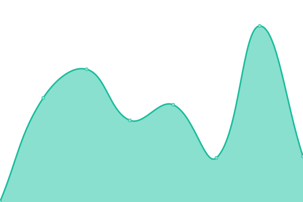
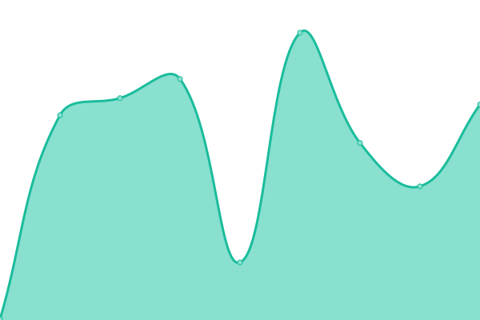
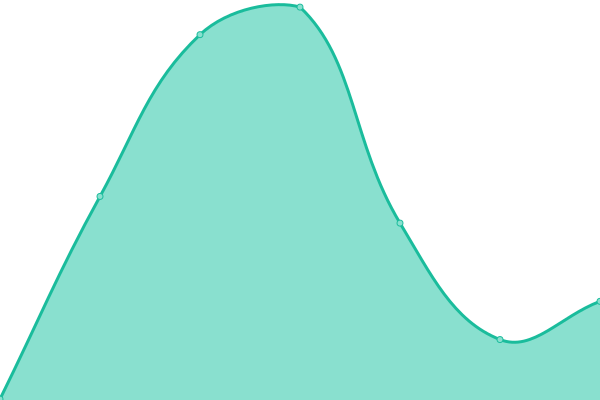

#  Upptime

This repository contains the open-source uptime monitor and status page | powered by [Upptime](https://github.com/upptime/upptime).

you can get your own unlimited and free uptime monitor and status page, powered entirely by a GitHub repository. We use [Issues](https://github.com/hst1189/upptime/issues) as incident reports, [Actions](https://github.com/hst1189/upptime/actions) as uptime monitors, and [Pages](https://hst1189.github.io/upptime) for the status page.

<!--start: status pages-->
<!-- This summary is generated by Upptime (https://github.com/upptime/upptime) -->
<!-- Do not edit this manually, your changes will be overwritten -->
<!-- prettier-ignore -->
| サイト | 状態 | 履歴 | 応答時間 | 稼働時間 |
| --- | ------ | ------- | ------------- | ------ |
|  [grapehut](https://www.grapehut.xyz/) | 🟩 正常 | [grapehut.yml](https://github.com/hst1189/upptime/commits/HEAD/history/grapehut.yml) | 

 246ミリ秒
     
 | 

<a href="https://status.grapehut.xyz/history/grapehut">75.25%</a>
    

|  [blog](https://blog.grapehut.xyz/) | 🟩 正常 | [blog.yml](https://github.com/hst1189/upptime/commits/HEAD/history/blog.yml) | 

 212ミリ秒
     
 | 

<a href="https://status.grapehut.xyz/history/blog">75.25%</a>
    

|  [gmerss](https://gmerss.grapehut.xyz/) | 🟩 正常 | [gmerss.yml](https://github.com/hst1189/upptime/commits/HEAD/history/gmerss.yml) | 

 267ミリ秒
     
 | 

<a href="https://status.grapehut.xyz/history/gmerss">74.97%</a>
    

|  [webstack](https://webstack.grapehut.us.kg/) | 🟥 停止 | [webstack.yml](https://github.com/hst1189/upptime/commits/HEAD/history/webstack.yml) | 

 227ミリ秒
     
 | 

<a href="https://status.grapehut.xyz/history/webstack">74.97%</a>
    

|  [myfont](https://myfont.grapehut.xyz/) | 🟩 正常 | [myfont.yml](https://github.com/hst1189/upptime/commits/HEAD/history/myfont.yml) | 

 220ミリ秒
     
 | 

<a href="https://status.grapehut.xyz/history/myfont">75.25%</a>
    

|  [live2d-widget](https://live2d-widget.grapehut.xyz/) | 🟩 正常 | [live2d-widget.yml](https://github.com/hst1189/upptime/commits/HEAD/history/live2d-widget.yml) | 

 236ミリ秒
     
 | 

<a href="https://status.grapehut.xyz/history/live2d-widget">74.38%</a>
    

|  [live2d-cubism3](https://live2d-cubism3.grapehut.xyz/) | 🟩 正常 | [live2d-cubism3.yml](https://github.com/hst1189/upptime/commits/HEAD/history/live2d-cubism3.yml) | 

 173ミリ秒
     
 | 

<a href="https://status.grapehut.xyz/history/live2d-cubism3">74.38%</a>
    

|  [status](https://status.grapehut.xyz/) | 🟩 正常 | [status.yml](https://github.com/hst1189/upptime/commits/HEAD/history/status.yml) | 

 226ミリ秒
     
 | 

<a href="https://status.grapehut.xyz/history/status">0.00%</a>
    

|  [miraitech-kinsta](https://mirai-tech.us.kg/) | 🟥 停止 | [miraitech-kinsta.yml](https://github.com/hst1189/upptime/commits/HEAD/history/miraitech-kinsta.yml) | 

 282ミリ秒
     
 | 

<a href="https://status.grapehut.xyz/history/miraitech-kinsta">50.08%</a>
    

|  [miraitech](https://miraitech-chiyoda.com/) | 🟥 停止 | [miraitech.yml](https://github.com/hst1189/upptime/commits/HEAD/history/miraitech.yml) | 

 0ミリ秒
     
 | 

<a href="https://status.grapehut.xyz/history/miraitech">0.00%</a>
    

<!--end: status pages-->

[**Visit our status website →**](https://hst1189.github.io/upptime)

## 📄 Set up

[参考设定](SETUP.md)

## 📄 License

- Powered by: [Upptime](https://github.com/upptime/upptime)
- Code: [MIT](./LICENSE) © [Anand Chowdhary](https://anandchowdhary.com), supported by [Pabio](https://pabio.com)
- Data in the `./history` directory: [Open Database License](https://opendatacommons.org/licenses/odbl/1-0/)
